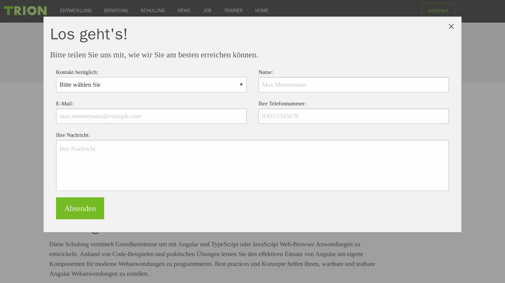

# Automate screen capture with Puppeteer or Playwright

This project contains automated tests for web applications using Playwright and Puppeteer. Both test suites are designed to run in Docker containers and simulate user interaction with a web page, capturing video and screenshots.

See the [puppeteer](puppeteer/) and [playwright](playwright/) directories for more information on running the tests and integrating them into a CI/CD pipeline.

## Screen Recordings

[video.webm](https://github.com/trion-development/screen-capture-puppeteer-playwright/assets/25386154/c307f09a-3f2d-4770-ad08-97f910d90746)

